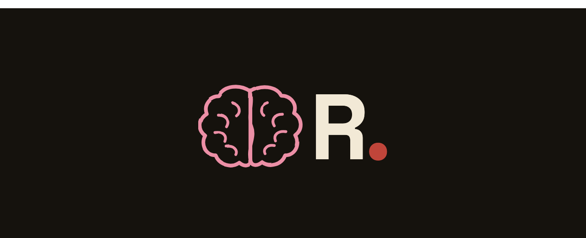
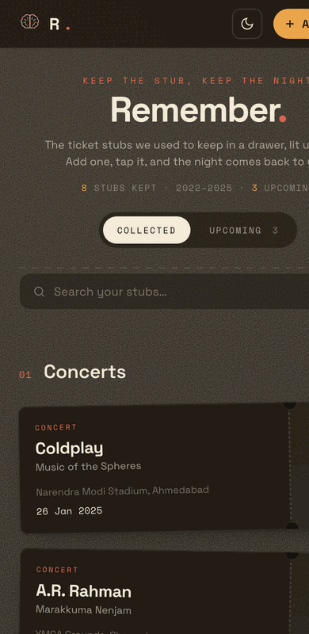
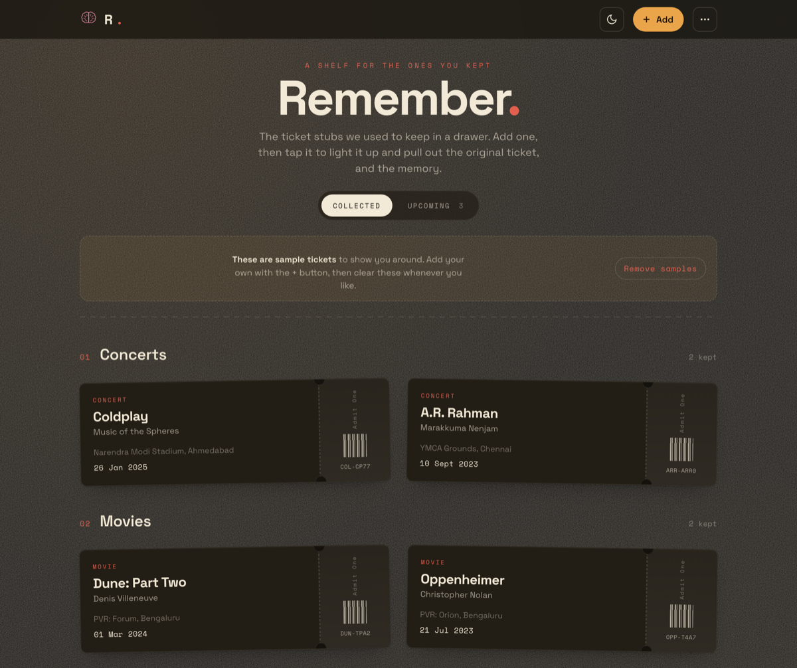
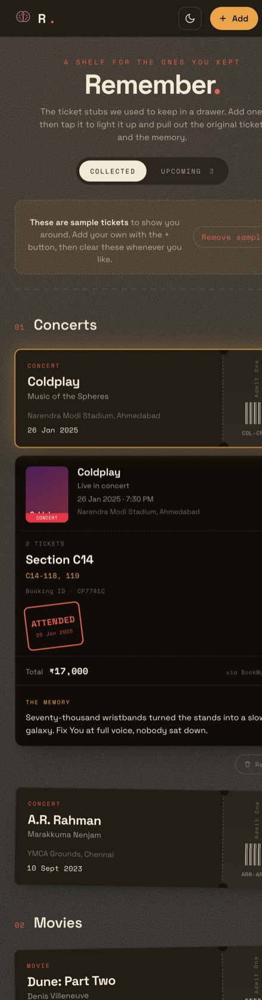
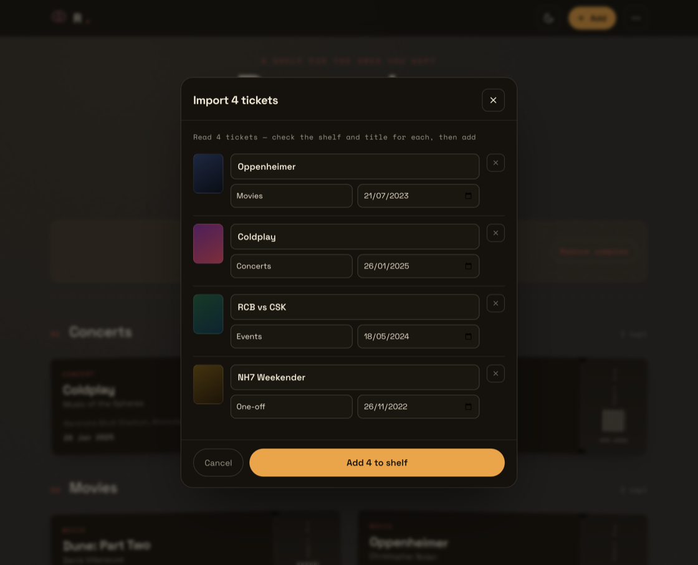
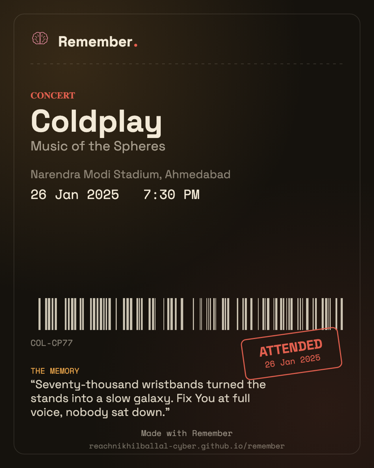
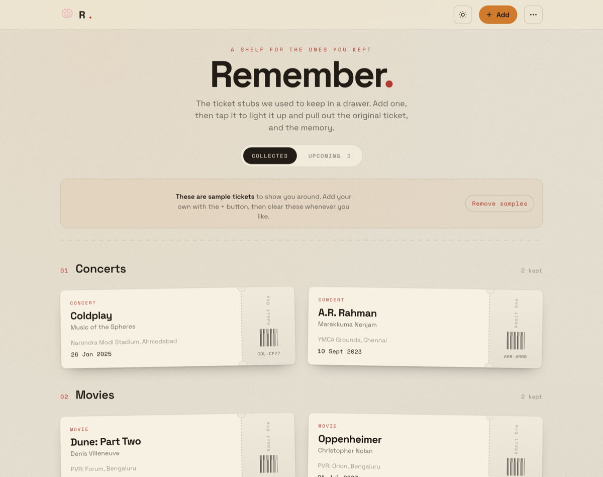

<div align="center">



### Keep the stub. Keep the night.

A nostalgic shelf for the ticket stubs you kept. Add a photo of a ticket and Remember
reads it, sorts it, and files it. Tap a stub to light it up and pull out the original
ticket, and the memory.

[**▶ Open the app**](https://reachnikhilballal-cyber.github.io/remember/) · [Design directions](https://reachnikhilballal-cyber.github.io/remember/directions.html)


</div>

<div align="center">

</div>



---

People used to keep ticket stubs in a drawer: the concert, the film, the match, the
one-off night you never forgot. **Remember** is that drawer as a single, design-focused web
app. Stubs are filed by kind (**Concerts · Movies · Events · One-off**), with a
**Collected / Upcoming** tab keeping the nights you've had separate from the ones still
ahead. The whole thing runs in your browser; nothing leaves your device.

## ✦ What it does

- **Add a ticket** with `+`: drop a **photo or screenshot of the real ticket**, or type the
  details. It's filed automatically: past events to **Collected**, future ones to
  **Upcoming**.
- **Reads the screenshot for you.** Drop a BookMyShow / PVR-style ticket and it's read
  **on-device** (Tesseract.js OCR, right in the browser) to pre-fill the title, date, time,
  venue, screen, seats, booking ID and amount, ready for you to confirm.
- **Add many at once.** From the `⋯` menu, pick a pile of screenshots, and each is read,
  **auto-classified** onto the right shelf, and dated, then a quick review list lets you fix
  anything before adding them all in one go.
- **Tap a stub → the original ticket.** If you added a photo you see *that* photo; otherwise
  a faithful recreation of the M-ticket (a live **QR** for upcoming, an **"Attended"** stamp
  for the ones already gone), with the one line you wrote underneath.
- **Yours, on your device.** Everything lives in IndexedDB, with no account and no server. **Export
  / Import** a JSON backup from the menu to move between devices.
- **Light & dark, installable, offline.** A theme toggle, Add-to-Home-Screen, and it works
  without a connection once loaded.
- **Find & tend your shelf.** Search by title / venue / artist, **edit** any stub (with an
  *Undo* if you remove one), **tap the photo** to see the full ticket, and **add upcoming
  events to your calendar** (`.ics`). A running line keeps count of what you've kept.
- **Share a stub as a card.** Turn any ticket into a clean image (drawn on-device) and send
  it to the share sheet, or save the PNG. Every card carries the link back.

<table>
<tr>
<td width="36%"></td>
<td width="64%"></td>
</tr>
<tr>
<td align="center"><em>Tap a stub, out comes the original ticket.</em></td>
<td align="center"><em>Add many: read, classified, and filed in one go.</em></td>
</tr>
</table>

<div align="center">

<br/><sub><em>Share any stub as an image card.</em></sub>
</div>

## ✦ How it works

- Each page is **fully self-contained**, with inline CSS + JS and no build step or framework. Fonts
  load from Google Fonts ([Space Grotesk](https://fonts.google.com/specimen/Space+Grotesk)
  for display, Space Mono for the serials).
- On the shelf, every ticket is a skeuomorphic **stub**: a perforated tear edge, a barcode,
  a monospace serial. Tap it and it glows, then expands.
- OCR runs as **WebAssembly in the browser**, so the image is never uploaded anywhere. Reading
  the OCR assets needs a connection the first time; after that they're cached.
- Tickets file themselves by **date** (past vs. upcoming) and by a **classifier** that reads
  cinema / sport / concert cues to pick the shelf.

## ✦ Run it locally

No build needed; it's a static site.

```bash
git clone https://github.com/reachnikhilballal-cyber/remember.git
cd remember
python3 -m http.server 4730
# open http://localhost:4730/
```

> Serve it over `http://` (not `file://`) so the service worker, OCR worker and IndexedDB
> all behave.

## ✦ Design directions

Before the app there were three static explorations of the same shelf. Open
[`directions.html`](directions.html):

| | Direction | The feeling |
|---|---|---|
| **A** | The Vintage Shelf, light | Warm paper, torn stubs on a tilt, a soft amber glow. |
| **B** | The Vintage Shelf, dark | The same shelf after dark. The app's default. |
| **C** | The Editorial Wall | Oversized type, a filed grid, an electric accent. |

<details>
<summary><strong>Light mode</strong></summary>
<br/>

</details>

## ✦ Tech

Vanilla HTML / CSS / JS · IndexedDB · a service worker + Web App Manifest (PWA) ·
[Tesseract.js](https://tesseract.projectnaptha.com/) for on-device OCR · Space Grotesk +
Space Mono. The brand mark (an **R** with a hand-sketched brain for memory, and a terracotta
fullstop) and the PWA icons are generated from [`icon.svg`](icon.svg) via
[`shot.html`](shot.html).

## ✦ Roadmap ideas

Skip duplicates on bulk import · share a stub as an image card · an install nudge · sort
within a shelf · haptics on tap. PRs and ideas welcome.

---

<div align="center">

Built by **[Nikhil Ballal](https://nikhilballal.com)** · MIT licensed

</div>
